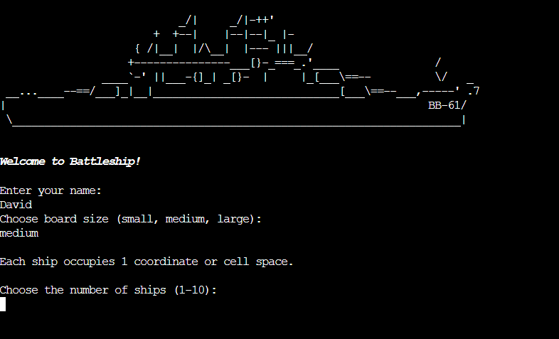
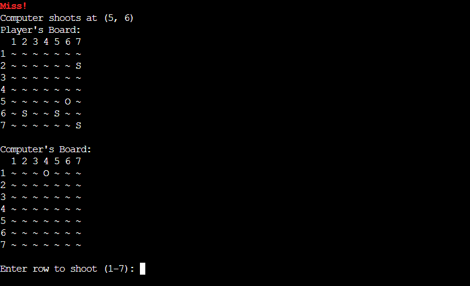

# Battleship Game

- [Battleship Game](#battleship-game)
  * [Introduction & Overview](#introduction---overview)
  * [Features](#features)
    + [Screenshots](#screenshots)
  * [Project Rationale and Design Decisions](#project-rationale-and-design-decisions)
    + [Object-Oriented Programming](#object-oriented-programming)
  * [Testing](#testing)
    + [Validator Testing](#validator-testing)
    + [Manual Testing](#manual-testing)
    + [Bugs](#bugs)
  * [Technologies Used](#technologies-used)
    + [Tools and Resources](#tools-and-resources)
  * [Deployment](#deployment)
    + [Heroku](#heroku)
  * [Local Development Setup](#local-development-setup)
    + [Introduction](#introduction)
    + [Prerequisites](#prerequisites)
    + [Why Visual Studio Code and WSL?](#why-visual-studio-code-and-wsl-)
    + [Setting Up the Environment](#setting-up-the-environment)
  * [Credits & Acknowledgments](#credits---acknowledgments)
    + [Acknowledgements](#acknowledgements)

<small><i><a href='http://ecotrust-canada.github.io/markdown-toc/'>Table of contents generated with markdown-toc</a></i></small>

## Introduction & Overview 

Battleship Game is a classic naval warfare strategy game brought to life as a Python-based command-line application. This project showcases the application of Python programming concepts, including object-oriented design, randomization, and user interaction in a terminal-based environment. The game is designed for both casual players and coding enthusiasts who enjoy strategy games and wish to experience the nostalgic feel of playing Battleship.

The Battleship Game offers a turn-based gameplay experience where players compete against a computer opponent. Players and the computer take turns to guess the location of each other's ships on a grid, aiming to sink all enemy ships first. The game provides immediate feedback on hits and misses, enhancing the interactive aspect and keeping players engaged throughout.

You can play the game live [here](https://battleship-3-f90d3c0779fd.herokuapp.com/).

## Features

This implementation includes features such as:

- A welcome screen with ASCII art for an immersive start

- Configurable board sizes for varied difficulty levels

- **In the game, the following symbols are used on the board:** 

  - S: Indicates a ship is present at this position.
  - O: Indicates a missed shot.
  - ~: Indicates water where no shots have been fired.

- Randomized ship placement for both player and computer

- Clear visual feedback for hits, misses, and the final state of the game board

- Cross-platform compatibility, ensuring smooth execution on different operating systems including Windows and Unix-based systems like Heroku

### Screenshots







## Project Rationale and Design Decisions

### Object-Oriented Programming

I decided to use object-oriented programming principles to organize the game's logic in a structured and modular way. Specifically, the `Board` class includes all the functionality related to the game board, such as ship placement, displaying the board, and handling shots. This organization provides several benefits:

- **Reusability:** The class can be reused and extended for different versions of the game.

- **Readability:** By separating the board logic into its own class, the main game logic becomes clearer and easier to follow.

- **Maintainability:** Changes to the board logic can be made within the `Board` class without affecting other parts of the program.

Some of the methods used in this project include:

- **Grid Generation Using Loops:** Instead of hardcoding the grid, I used a loop to generate it based on the selected board size. This makes the code more flexible and adaptable to different board sizes.

- **`place_ships` Method:** This method randomly places a specified number of ships on the board. It ensures that ships are placed without overlapping and within the board's boundaries.

- **`take_shot` Method:** This method handles the logic for a shot taken at a specific position on the board. It updates the board's state and provides feedback on whether the shot was a hit or a miss.

- **`game_loop` Function:** This function manages the main game loop, alternating turns between the player and the computer, and checks for win conditions.

- **`display` Method:** This function displays the game board. I used the enumerate function to loop over the grid while keeping track of the row index. This simplifies accessing both the row data and its corresponding index in a single loop. This method was created the assistance of OpenAI's ChatGPT.

My background knowledge in Python and OOP principles was significantly enhanced through courses on [Udemy](https://www.udemy.com/course/100-days-of-code/) and [Codecademy](https://www.codecademy.com/catalog/language/python). Specifically, lessons 20 - 22 in the Udemy course, which covered the development of Snake and Pong games, were particularly useful in learning how to implement classes and manage game logic.

## Testing

### Validator Testing

To ensure that the Python code adheres to PEP 8 standards, I used the online validator [PEP8CI](https://pep8ci.herokuapp.com/). This tool helped me identify and correct any issues related to code style and formatting, ensuring that the code is clean, readable, and follows best practices.

### Manual Testing

In addition to using the PEP 8 validator, I performed extensive manual testing to ensure the game's functionality and user experience were up to standard. Here are some of the manual tests conducted:

- **Input Validation:** 
  - Tested various valid and invalid inputs for selecting the board size (e.g., "small", "medium", "large", "123" and other random inputs that does not match the instructions).
  - Tested number of ships input with values within and outside the valid range (1-10).

- **Gameplay Testing:**
  - Tested gameplay by running multiple sessions with different board sizes and ship numbers.
  - Verified that hits and misses were correctly registered on both the player's and the computer's boards.
  - Ensured that the game correctly identified when all ships were sunk, and appropriate win/loss messages were displayed.

- **Edge Cases:**
  - Entered non-numeric values for row and column inputs during the game to ensure the program handled such cases gracefully.

- **Cross-Platform Testing:**
  - Ran the game on different operating systems, including Windows and Unix-based systems, to ensure that the `clear_screen` function worked correctly across platforms.

### Bugs

- **Clear Screen Bug**


There was an issue where the clear_screen function did not work properly when the game was deployed on Heroku. The cls command, which is used to clear the screen on Windows, is not recognized on Unix-based systems like those used by Heroku.

- **Resolution**

The bug was resolved by updating the clear_screen function to use the appropriate command based on the operating system. The updated function checks the OS type and uses cls for Windows and clear for Unix-based systems:

```python
from os import system, name

def clear_screen():
    """
    Function to clear terminal. Uses 'cls' on windows
    and 'clear' on UNIX-based OS.
    """
    if name == "nt":
        system("cls")
    else:
        # For UNIX based OS.
        system("clear")
```

Instead of importing complete os library only 'system' and 'name' is imported. This solved the issue.

## Technologies Used

### Tools and Resources

- [Git](https://git-scm.com/): Employed for version control, enabling regular commits to Git and updates to GitHub from the terminal in Gitpod.

- [GitHub](https://github.com/): Hosts the repository containing the project's code. GitHub Pages also hosts the live version of the website.

- [Visual Studio Code](https://code.visualstudio.com/): The code editor of choice for developing the website, offering powerful coding and debugging tools.

- [OpenAI's ChatGPT](https://openai.com/): Assisted in validating code, checking spelling, providing translations, offering coding advice, and supporting the refinement of the website's content and functionality. ChatGPT also played a role in generating content for documentation and assisting with real-time troubleshooting during development.

- [Fontstyle](https://pypi.org/project/fontstyle/): Used to apply styles such as bold and italic to terminal text for enhanced user experience.

- [PEP8CI](https://pep8ci.herokuapp.com/): Used for validating Python code to ensure adherence to PEP 8 standards.

- [Heroku](https://www.heroku.com/): Used for deploying the live version of the Battleship game, providing a cloud platform for easy access and testing.

## Deployment

### Heroku

The Battleship game is deployed on Heroku for easy access. You can play the game live [here](https://battleship-3-f90d3c0779fd.herokuapp.com/).

1. **Create a New Heroku App**: Log in to your Heroku account and create a new app. You can do this via the Heroku dashboard or the Heroku CLI.

2. **Set Buildpacks**: Set the buildpacks for Python and Node.js to ensure that Heroku correctly handles the dependencies.

3. **Link to GitHub Repository**: Link your Heroku app to your GitHub repository. 

4. **Deploy the Application**: Enable automatic deploys or manually deploy the branch of your choice. This project is automatically deployed.

## Local Development Setup

### Introduction

While the course recommends using Codeanywhere as a cloud-based development environment, for this project, I opted to use Visual Studio Code installed locally on my Windows computer. My familiarity with Visual Studio Code and its immediate responsiveness compared to the process of setting up and loading Codeanywhere each time greatly influenced this choice.

To replicate this local development environment, I installed the following programs to my system:

- Visual Studio Code as my primary code editor.
- Windows Subsystem for Linux (WSL) for a Linux-compatible terminal and development environment on Windows.
- Git for version control and cloning the project repository.

### Prerequisites

Before you can run the Battleship game locally, you need to install the required Python packages, including `fontstyle`. You can do this using pip:

```sh
pip install fontstyle
```

### Why Visual Studio Code and WSL?

Visual Studio Code is a powerful and versatile code editor that supports a wide range of programming languages and frameworks. Its extensive library of extensions makes it highly customizable, fitting perfectly into my workflow. Furthermore, by leveraging the Windows Subsystem for Linux (WSL), I was able to create a Linux-like development environment on Windows. This setup allowed me to use Linux commands and tools directly in Windows, offering the best of both worlds for web development.

Choosing Visual Studio Code and WSL over Codeanywhere was a strategic decision to optimize my development process, capitalizing on speed and efficiency without sacrificing the versatility and power needed for complex web development tasks.

### Setting Up the Environment

1. **Install WSL**: Follow the instructions provided by Microsoft to install WSL on your Windows machine. Choose a Linux distribution of your preference from the Microsoft Store (Ubuntu is a popular choice).

3. **Clone the Repository**: Open VS Code's integrated terminal, switch to your WSL environment, and clone the Battleship repository using Git:
    ```sh
    git clone https://github.com/darvid-223/battleship.git
    cd battleship
    ```

4. **Create a Virtual Environment**: It's recommended to use a virtual environment to manage dependencies.
    ```sh
    python -m venv venv
    source venv/bin/activate  # On Windows use `venv\Scripts\activate`
    ```

5. **Install Dependencies**: Install all necessary dependencies using the `requirements.txt` file.
    ```sh
    pip install -r requirements.txt
    ```

6. **Run the Application**: Start the game by running the main Python file.
    ```sh
    python run.py
    ```

## Credits & Acknowledgments

### Acknowledgements

- I am deeply grateful to my mentor, Sheryl Goldberg, for her invaluable feedback and insightful suggestions, which greatly enhanced this project.

- Special thanks to my friend Lucas Behrendt, whose feedback and tips from his experience in the same course were immensely helpful.

- Special thanks to https://www.asciiart.eu/ for providing the ASCII art used in this project.

- Special thanks to [Udemy's 100 Days of Code: The Complete Python Pro Bootcamp for 2023](https://www.udemy.com/course/100-days-of-code/) for providing comprehensive lessons on Python and object-oriented programming, which significantly contributed to the development of this project. Specifically, lessons 20 - 22 on creating Snake and Pong games were particularly useful in learning how to implement classes effectively.

This project was developed with the assistance of OpenAI's ChatGPT in the following areas:
- **Code Validation**: ChatGPT helped validate the syntax and logic of the code.
- **Spelling and Grammar Checks**: Assisted in checking and correcting spelling and grammar in the documentation and code comments.
- **Translations**: Provided translations for multilingual support in the documentation.
- **Coding Advice**: Offered suggestions and advice on coding practices and problem-solving approaches.
- **Content Generation**: Assisted in generating content for the README and other documentation.
- **Real-Time Troubleshooting**: Supported real-time debugging and troubleshooting during the development process.

Special thanks to [OpenAI's ChatGPT](https://openai.com/) for its invaluable support in refining the content and functionality of this project.


